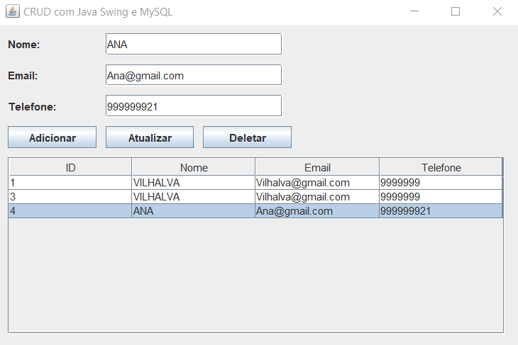
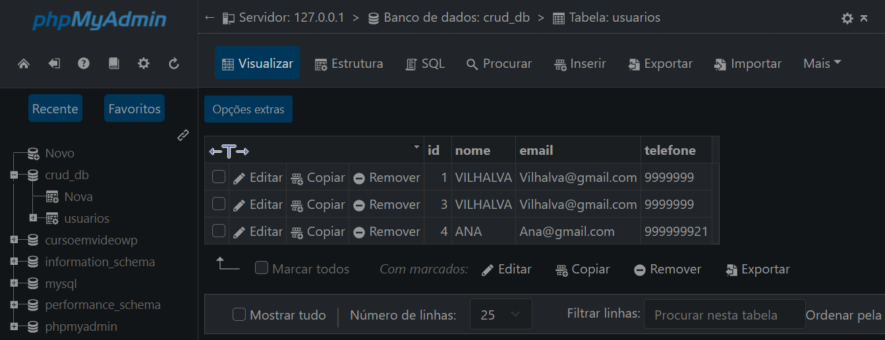

# CRUD COM JAVA SWING
👨‍🏫CRUD DE NOME, EMAIL E TELEFONE COM JAVA-SWING E MYSQL.

 <br>
 <br>

## DESCRIÇÃO:
O aplicativo `CRUD COM JAVA SWING` foi desenvolvido com Java Swing e MySQL é um sistema básico de CRUD (Create, Read, Update, Delete) para gerenciar informações de usuários em um banco de dados. Aqui está uma descrição do que ele faz:

1. **Adicionar Usuário:**
   - Permite adicionar novos usuários informando nome, email e telefone.

2. **Atualizar Usuário:**
   - Permite selecionar um usuário na tabela e atualizar suas informações de nome, email e telefone.

3. **Deletar Usuário:**
   - Permite selecionar um usuário na tabela e removê-lo do banco de dados.

4. **Listar Usuários:**
   - Exibe todos os usuários cadastrados em uma tabela, mostrando seu ID, nome, email e telefone.

## EXECUTANDO O PROJETO:
1. **Configuração do Banco de Dados:**
   - Antes de executar o app, é necessário importar o arquivo `./DATABASE/DATABASE.sql para o seu banco de Dados Mysql.

2. **Configuração do PHP:**
   - Abra o arquivo `CODIGO\src\main\java\com\mycompany\crudswing\DatabaseConnection.java` e ajuste as configurações do banco de dados:

     ```java
    private static final String URL = "jdbc:mysql://localhost:3306/crud_db";
    private static final String USER = "root";
    private static final String PASSWORD = "";
     ```

3. **Executando no NetBeans IDE:**
   1. **Inicie o NetBeans:**
      Abra o NetBeans IDE a partir do menu Iniciar (Windows) ou do lançador de aplicativos (macOS).

   2. **Navegue até o Projeto:**
      No menu superior, clique em "Arquivo" (ou "File" em inglês) e escolha "Abrir Projeto" (ou "Open Project").

   3. **Selecione o Diretório do Projeto:**
      Navegue até o diretório `CODIGO`, onde está localizado o projeto e selecione a pasta principal. Esta pasta contém o arquivo `pom.xml`.

   4. **Abra o Projeto:**
      Selecione a pasta do projeto e clique em "Abrir" (ou "Open" em inglês).

   5. **Aguarde a Abertura:**
      O NetBeans irá carregar o projeto. Isso pode levar alguns momentos, dependendo do tamanho do projeto e da velocidade do seu computador.

   6. **Projeto Aberto:**
      Uma vez que o projeto é carregado com sucesso, ele aparecerá no painel "Projetos" no canto esquerdo do IDE, e você poderá executa-lo clicando em `Run`.

4. **Interagindo com APP:**
   1. **Interface do Usuário:**
      - Ao iniciar o aplicativo, você verá uma interface com campos para inserir nome, email e telefone de um novo usuário.
      - Abaixo dos campos de entrada, há botões para adicionar, atualizar e deletar usuários, além de uma tabela que exibe todos os usuários cadastrados.

   2. **Adicionar Usuário:**
      - Preencha os campos "Nome", "Email" e "Telefone".
      - Clique no botão "Adicionar" para incluir o novo usuário na tabela e no banco de dados.

   3. **Atualizar Usuário:**
      - Selecione um usuário na tabela clicando na linha correspondente.
      - Edite os campos de "Nome", "Email" e "Telefone".
      - Clique no botão "Atualizar" para salvar as alterações no banco de dados.

   4. **Deletar Usuário:**
      - Selecione um usuário na tabela clicando na linha correspondente.
      - Clique no botão "Deletar" para remover o usuário selecionado do banco de dados.

   5. **Listar Usuários:**
      - A tabela exibe todos os usuários cadastrados, mostrando seu ID, nome, email e telefone.
      - Ela é atualizada automaticamente após adicionar, atualizar ou deletar usuários.

## TECNOLOGIAS USADAS:
- [LINGUAGEM JAVA:](https://github.com/VILHALVA/CURSO-DE-JAVA) A linguagem de programação Java é amplamente utilizada para o desenvolvimento de aplicativos devido à sua portabilidade, segurança e robustez. Ela é uma escolha popular para desenvolver aplicativos desktop, web e móveis.

- [JAVA SWING:](https://github.com/VILHALVA/CURSO-DE-JAVA-SWING) Java Swing é um conjunto de bibliotecas gráficas para a criação de interfaces de usuário (UI) em Java. Ele fornece componentes gráficos avançados, como botões, caixas de texto, tabelas e muito mais, permitindo que os desenvolvedores criem aplicativos desktop com uma interface de usuário rica e interativa.

- [MYSQL:](https://github.com/VILHALVA/CURSO-DE-MYSQL) O MySQL é um sistema de gerenciamento de banco de dados relacional de código aberto que foi lançado pela primeira vez em 1995. Foi desenvolvido pela empresa sueca MySQL AB, fundada por Michael Widenius, David Axmark e Allan Larsson.

- [NETBEANS IDE:](https://netbeans.apache.org/download/index.html) O NetBeans IDE é um ambiente de desenvolvimento integrado gratuito e de código aberto para o desenvolvimento de aplicativos Java, bem como para várias outras linguagens de programação, como PHP, C/C++, e HTML5. Ele oferece uma série de recursos poderosos, como edição de código avançada, depuração, controle de versão e integração com servidores de aplicativos, facilitando o desenvolvimento de software em Java e outras plataformas.

## CREDITOS:
- [PROJETO CRIADO PELO VILHALVA](https://github.com/VILHALVA)


